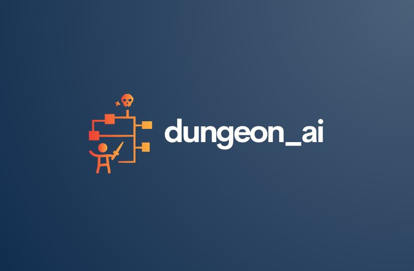
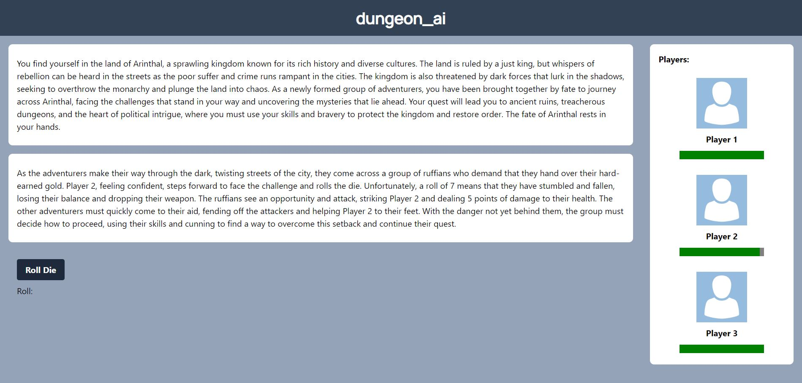
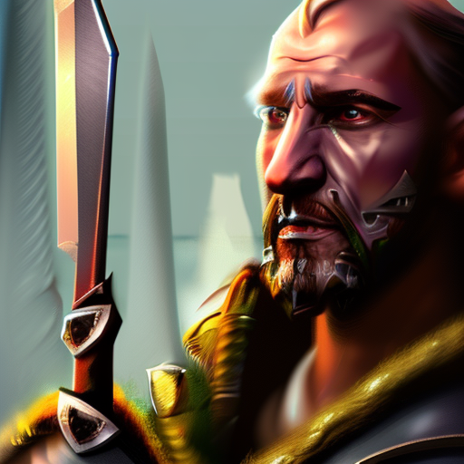
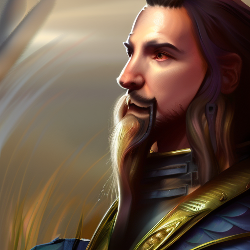
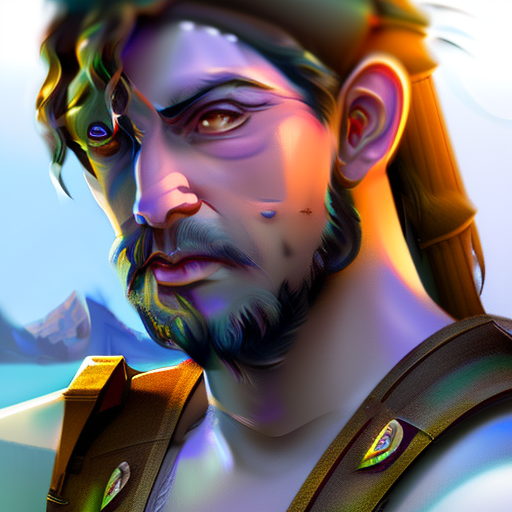

# **dungeon_ai** - Iowa State Computer Science Hackathon 2023

Team Members: Logan Jorgensen, Sam McGrath, David Szczepanik, Eli Brady
 
 
 

# Project Problem: Lack of Accessibility to Dungeons & Dragons

Our team decided to pursue this project to attempt to make a Dungeons & Dragons style experience that does not require an experienced individual to act as the Dungeon Master.
 
 

# Description: A Web-Based Game Inspired by Dungeons & Dragons

dungeon_ai is a full-stack web application meant to increase accessibility to Dungeons & Dungeons style games by removing the need for an experienced Dungeon Master. The user can create a character and allocate their skill points to a pool of skills, and embark on an adventure to find treasure, encounter monsters, and explore.

Games consist of campaigns with three characters. The ‘virtual Dungeon Master” is generated by AI. Both the storyline, as well as images for environments and player characters are generated using various AI technologies. The player photos are generated based on a user’s description. Story generation allows for wide variety of scenarios that the characters will experience in their playthrough, ensuring that no two playthroughs are the same.

The story generation is handled by making requests to the external OpenAI API, whereas AI-based image generation is done on the FastAPI application aspect of the project using Stable Diffusion.
 
 

# The Tech Stack

## Technologies Used: React, Tailwind CSS, Vite, SpringBoot (Java), FastAPI (Python), PyTorch

<!-- Import Image into Markdown File -->

# Project Structure

The project is split into three main directories:

1. /frontend - Directory for the React frontend
2. /backend - Directory for the SpringBoot backend
3. /diffusion - Directory for the FastAPI StableDiffusion Application
    
    

# The Frontend

<b>Individual "Game" view rendered with React</b>

 
 

# The Backend

All logic and data for the game is handled throught the backend via a SpringBoot application.

- Handles storage via Hibernate & MySQL to store game information, history of game events, player data, etc.
- Henerates new events for a game via some internal game logic combined with a prepared prompt which is sent to the OpenAI API
- Generates a prepared prompt to send to the StableDiffusion FastAPI application in order to generate images for players and events that occur during the game
- Feeds data to frontend via RESTful API requests
   
   

# StableDiffusion / FastAPI

### Some examples of character images generated by the model:

|          Image of a Warrior Character          |               Image of Paladin Character                |       Image of Another Paladin Character       |         Image of a Ghoul Character         |
| :--------------------------------------------: | :-----------------------------------------------------: | :--------------------------------------------: | :----------------------------------------: |
|  |  |  |  |

# Running the Project

To run the frontend application locally with Vite / npm:  1. "npm i"   2. "npm run dev" 

To run the FastAPI StableDiffusion Model locally with an Nvidia GPU (CUDA):
"diffuzers api"
 
 
